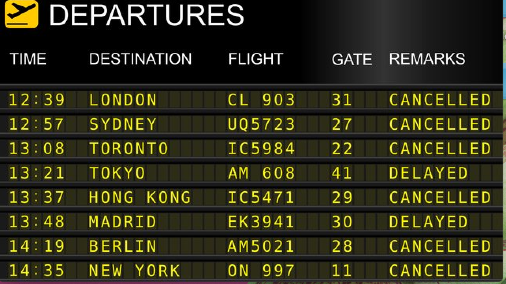
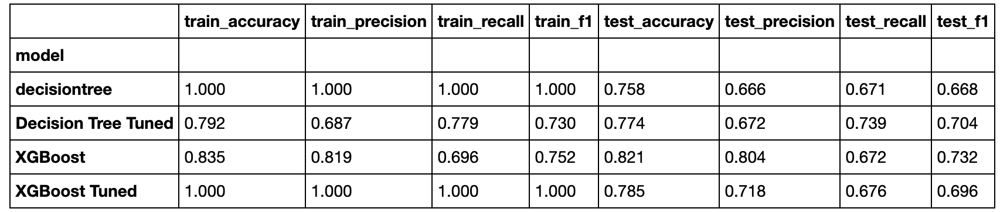

# Predicting Flight Delays 

## Introduction 

In the following project, our team of strategists aim to assist the United States Federal Aviation Administration in improving efficiencies across US airports. We will approach this problem by creating a Machine Learning model that is best able to predict whether a flight will be delayed or not, based on a variety of factors including airlines, airports, certain months/days of the week, as well as specific delay reasons (weather, security, etc.). 

The data used for this analysis is from Kaggle's "2015 Flights and Cancellation" [database](https://www.kaggle.com/usdot/flight-delays). Our team will obtain, clean, and preprocess this data, then take a random sample of 10,000 rows in order to conduct the predictive analysis. 

## Objectives 

1. Which machine learning model is most effective in predicting flight delays? 
2. How can we maximize our recall score to ensure that we do not miss any of our "delayed" flights' information when building our model?
3. Which features are the most important to our model? How can the FAA strategize to minimize the effects of of features that cause delays? 

## Data Cleaning 
- Removed NaN values by replacing with 0s or with median-values specific to that column 
- New feature was engineered that binned airports into categories based on flight traffic: heavy, medium, light and very light 
- One hot encoding of categorical features was employed: months, days of week, airlines and newly engineered flight traffic feature 
- SMOTE technique was applied in order to create synthetic data points to deal with the class imbalance
- Transformed target variable to a binary value of 1 if delay time was greater than 0, and 0 otherwise 

## Model result 
 

Our vanilla decision tree model is overfit to our training data, as seen by perfect metric scores of 1 across all performance metrics for the train set, but this does not appear to be the case once our model has been tuned. The test recall score improved from 0.671 to 0.739 after tuning. There were slight increases in test accuracy, precision and f1 scores as well, although much smaller relative increases than the recall score. Additionally, our tuned decision tree's top feature importances were "Arrival Delay", "Late Aircraft Delay" and "Airline Delay". Our recommendation to the FAA is to invest in resources to mitigate these specific types of delays, as they are the most powerful in predicting whether a flight is delayed or not. While it does not appear that a specific airline has a higher impact in predicting a delayed flight over another, more research should be allocated to identify the specific factors that cause an "Airline Delay" in order to prevent these delays going forward. When looking at the train and test confusion matrices for our decision tree model, overall, our model does a fairly good job at correctly classifying our results.

Next, we looked a the XGBoost model, whose test recall score only improved slightly after tuning. We also see a decrease in all the remaining test results; accuracy, precision and f1, therefore an increase in recall came at the expense of the other performance metrics. Interestingly, all of our train metrics in our tuned model had a result of 1; indicating that our model is overfit to our training data. Future work should look at altering the hyperparameters in the GridSearch in order to prevent overfitting, as well as optimize our XGBoost Tuned test recall further. 

# Recommendations 
- While XGBoost increased our test recall score, it was only marginally, and the resulting model was overfit to our train data 
- In future models, we should look to remove features that are not correlated with our target variable, as well as remove features that have low feature importances. Future work with more data cleaning could potentially lead us to stronger recall scores, without producing a model that is overfit 
- FAA should allocate resources to improve the efficiencies of Late Aircraft Delay, Arrival Delay and Airline Delay, as these types of delays had the highest feature importances in our models 
- The [link](https://adinasteinman.medium.com/guide-to-fitting-predicting-and-creating-functions-for-machine-learning-models-65adb8704185) here will bring you to my blog post that discusses the detailed steps I went through to conduct this process. Thank you for reading! 
